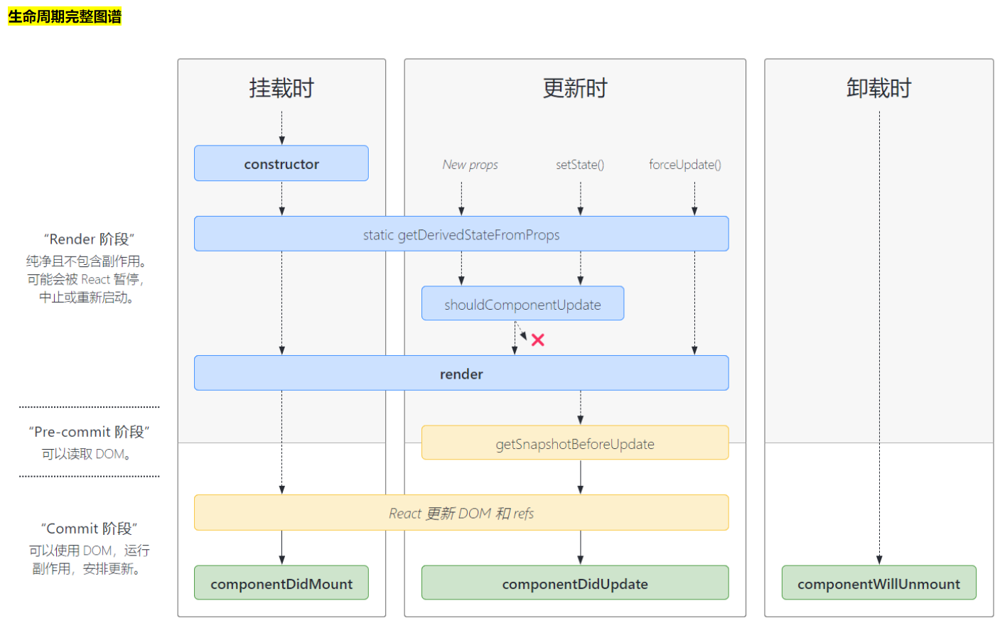
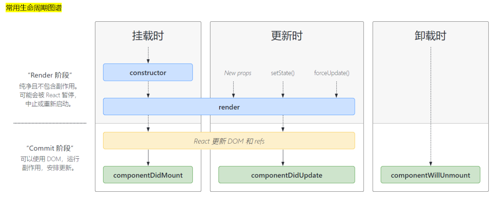
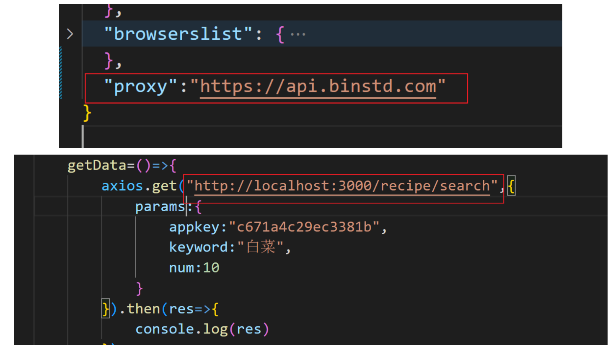
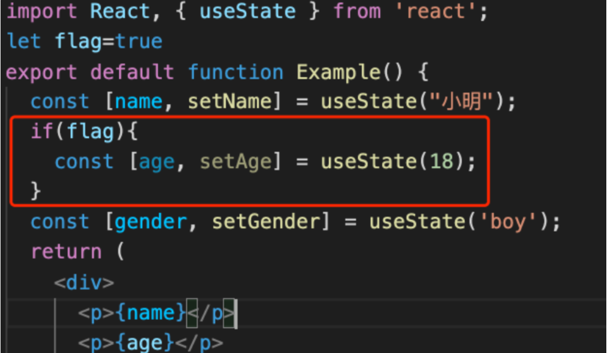
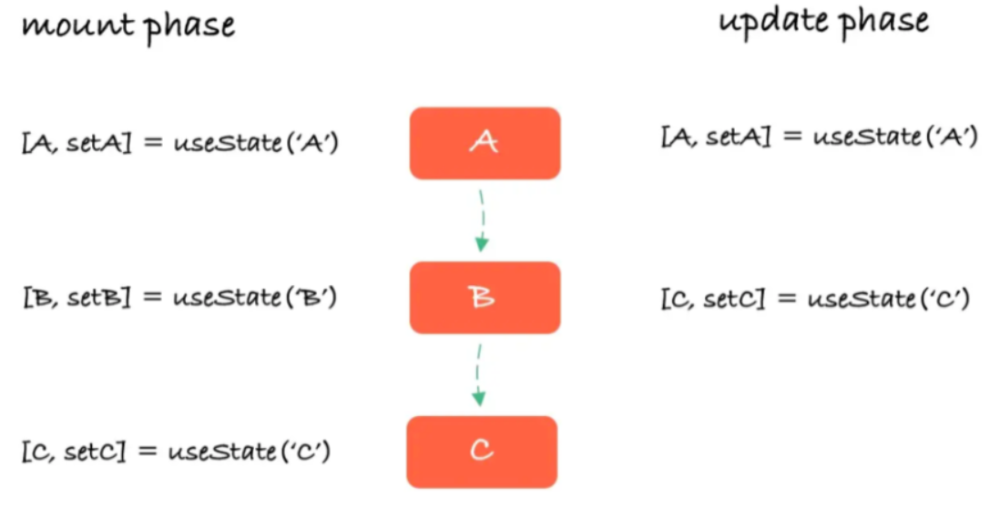
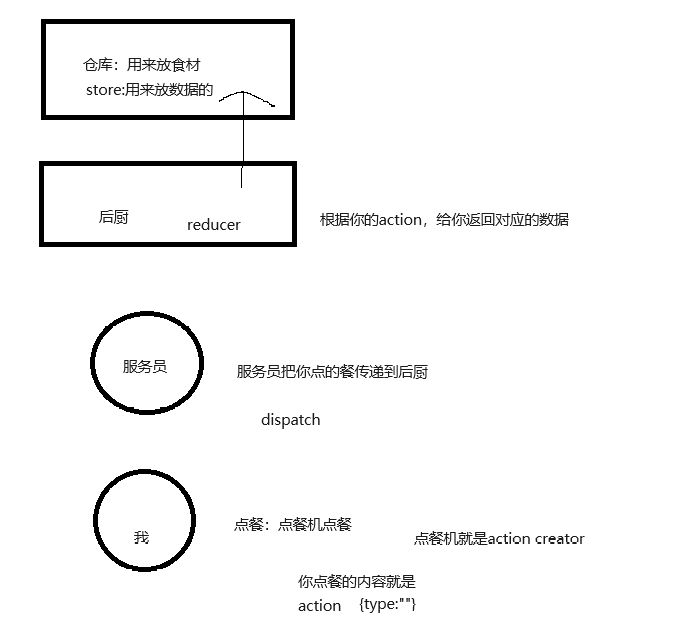

# 1.认识react

React 是一个声明式，高效且灵活的用于构建用户界面的 JavaScript 库

> React 起源于 Facebook 的内部项目，因为该公司对市场上所有 JavaScript MVC 框架，都不满意，就决定自己写一套，用来架设 Instagram 的网站。做出来以后，发现这套东西很好用，就在 2013 年 5 月开源了。

中文官网：https://zh-hans.react.dev/

2022年3月发布的18版本

2022年六月发布的18.2版本(目前最新)


## 1.基本结构

```html
<!DOCTYPE html>
<html lang="en">
<head>
    <meta charset="UTF-8">
    <meta name="viewport" content="width=device-width, initial-scale=1.0">
    <title>Document</title>
    <!--react核心包-->
    <script src="https://unpkg.com/react@18/umd/react.development.js"></script>
    <!--react dom相关的包-->
    <script src="https://unpkg.com/react-dom@18/umd/react-dom.development.js"></script>
    <!-- 提供es6和jsx的支持-->
    <script src="https://unpkg.com/@babel/standalone/babel.min.js"></script>
</head>
<body>
    <!--提供一个挂载点-->
    <div id="app"></div>
    <script type="text/babel">
        //1.获取到这个挂载点元素
       var container=document.getElementById("app");
       //2.创建一个根节点,接收我们的挂载点元素对象当参数
       var root=ReactDOM.createRoot(container) ;
       //3.调用渲染方法渲染页面,render里面放的是页面内容(内容指的是html标签或者组件)
       root.render( <h1>我是react</h1> ) //jsx，html标签不需要加引号

        //也可以简写为
       //ReactDOM.createRoot(document.getElementById("app")).render(<h1>哈哈哈哈</h1>)
    </script>
</body>
</html>
```

## 2.关于jsx

> 所谓的jsx其实就是允许在js中正常编写html而无需加引号

```jsx
const element = <h1>Hello, world!</h1>;
//JSX 允许你将 UI 结构写得和 HTML 很相似，但实际上它会被编译成 JavaScript 对象和函数调用

//这段 JSX 会被编译成下面的 JavaScript：
const element = React.createElement('h1', null, 'Hello, world!');
```

这种看起来可能有些奇怪的标签语法既不是字符串也不是 HTML。

它被称为 JSX， ⼀种 JavaScript 的语法扩展。 我们推荐在 React 中使⽤ JSX 来描述⽤户界⾯。


jsx中想写变量，使用{} 就可以插入变量

**=={ }相当于提供了js的执行环境，大括号里可以任意的js表达式（由运算符连接的），不能写语句（声明语句，if 、for）==**


注意事项

> 1.最外层只能有一个根元素：

```jsx
let ele=<div>   
            <p class="box">aaaa</p>
             <h1>你好</h1>
         </div>
```

> 2.jsx中，class要改为className

```jsx
 let ele=<div className="box">
                <p>123</p>
                <p>456</p>
            </div>
```

> 3.jsx中style必须写成对象的形式

```jsx
       let txt="哈哈哈我是你哥" 
       let a="title"

        let ele=<div className={a} style={{color:"red"}}> 
                  <h1>{txt}</h1>
                </div>
```

```jsx
        let cssStyle={
            width:"50px",
            height:"50px",
            color:"yellow"
        }

        let ele=<div className={a} style={cssStyle}>
                  <h1>{txt}</h1>
                </div>
```

```jsx
        let color="green"
        let ele=<div className={a} style={{color:color,width:"200px"}}>
                  <h1>{txt}</h1>
                </div>
```

> 4.样式中有多个单词组成的样式不能用横线连接，改为驼峰式

```jsx
 let ele=<div className={a} style={{color:color,width:"200px",marginLeft:"50px"}}>
                  <h1>{txt}</h1>
                  <a href={url}>百度</a>
                </div>
```

> 5.样式中是数字的，单位可以省略

```jsx
let ele=<div className={a} style={{color:color,width:200,marginLeft:50}}>
                  <h1>{txt}</h1>
                  <a href={url}>百度</a>
                </div>
```

> 6.jsx中标签数组会自动展开

```jsx
 let arr=[<h1>111</h1>,<h1>222</h1>];
 class Welcome extends React.Component{
        render(){
         
          return <div>
                    {arr}
                   
                </div>
        }
      }
```


# 2.组件

其实就是一段封装了html css js的代码，最终表现为一个自定义标签

组件都有自己独立的作用域：

> react中的组件分为两⼤类：
>
> ⼀**类是函数式组件（推荐）**
>
> ⼀**类是类组件 （过时）**


## 1.类组件

1.要将 React 组件定义为类，请继承内置的 Component 类并定义 render 方法：

**基本结构**

```jsx
      class Welcome extends React.Component{
            render(){ //是一个渲染方法，会自动调用
                return <h1>我是一个类组件</h1>
            }
      }
//使用
 root.render(<Welcome></Welcome>) ; //单双标签都行
```

==易错点==

```jsx
 return <h1>我是一个类组件</h1>//正确
 return
	<h1>我是一个类组件</h1> //错误写法，此时必须加括号
 return (
	<h1>我是一个类组件</h1>) //正确
```


### 1.关于Fragment

```jsx
<>
  <h1>hello</h1>
  <p>hello</p>
</>
```


这个空标签被称作 *[Fragment](https://zh-hans.react.dev/reference/react/Fragment)*。React Fragment 允许你将子元素分组，而不会在 HTML 结构中添加额外节点。

### 2.props

组件的属性类似于函数的从参数，可以让组件接收外面的数据，展现出不同的结果，

> props是类组件自带的属性，代表所有属性的集合

==注意，属性不能更改,因为属性是从外部传入的并不是组件自己的数据，所有没权利更改==

==如果想更改只能去修改数据源，让他重新传一个新属性==


==基本案例:==

```jsx
      class Welcome extends React.Component{
        render(){
            let {name}=this.props
            return <h1>hello，{name} </h1>
        }
      }
      root.render(<>
           <Welcome name="张三"/>
           <Welcome name="李四"/>
           <Welcome name="王五"/>
           <Welcome name="赵六"/>
           
        </>) ; 
```

==导航条高亮案例==

```jsx
      //props等同于函数的参数
      class Navi extends React.Component{
        render(){
            let {number}=this.props
            return (<ul>
                        <li style={{backgroundColor:number==1?"red":""}}>首页</li>
                        <li style={{backgroundColor:number==2?"red":""}}>产品</li>
                        <li style={{backgroundColor:number==3?"red":""}}>资讯</li>
                        <li style={{backgroundColor:number==4?"red":""}}>我们</li>
                    </ul> 
                )
                    
        }
      } 
      class Welcome extends React.Component{
        render(){
            let {name}=this.props
            return <h1>hello，{name} </h1>
        }
      }
      root.render(<>
           <Navi number="1"/>
           <Navi number="2"/>
           <Navi number="3"/>
           <Navi number="4"/>
           
        </>) ; 
           
```

#### 关于props.children

> 如果在组件标签内写内容，通过props.children读取
>
> 如果传⼊单个内容，返回的就是⼀个对象，如果传⼊多个内容的话，返回的就是数组

```jsx
      class Welcome extends React.Component{
        render(){
          console.log(this.props)
            return <>
                  
                    <h1>hello</h1>
                    <h1>world</h1>
                    {this.props.children}
                  </>
        }
      }

      root.render(<>
        
            <Welcome >
                <h1>我是一些额外的内容</h1>     
                <p>12123</p>
                <div>
                    <p>456</p>
                </div>
            </Welcome>
           
        </>) ; 
```

如果想把组件标签内的多个内容渲染到不同位置,通过角标访问即可

```jsx
      class Welcome extends React.Component{
        render(){
          console.log(this.props);
          return <div>
                    {this.props.children[0]}
                    <p>123</p>
                    {this.props.children[1]}
                    <h1>456</h1>
                    {this.props.children[2]}
                </div>
        }
      }
      root.render(
        <>
          <Welcome >
            <h1>我是在组件标签内加的内容</h1>  
            <p>额外添加的</p>
            <a>百度一下</a>
          </Welcome>  
        </>) ; 
```


### 3.state

state是属于组件内部私有的，外部无法访问

state 用于存储组件的动态数据，当组件的 state 更新时，组件会重新渲染以更新页面

使用state必须先定义初始值：

> 定义初始状态的两种方式
>
> **1.在构造器里定义**
>
> construcrot(){
>
>    super();////如果不调用super方法，子类就得不到this对象
>
> ​	this.state={
>
> ​	}
>
> }
>
> **2.在类中直接定义**
>
> state={
>
> ​      a:1
>
> ​    }

何时使用状态？

组件中什么东西将来会变化，就把什么东西定义成状态

只要修改了状态，组件就会重新渲染

> 1.不能直接修改state,必须采取setState方法去更改

```jsx
      class Welecome extends React.Component{
        state={
            num:1
        }
        change=()=>{
          this.setState({
              num:100
          })
        }
        render(){
          console.log("我重新渲染了")
          let {num}=this.state
          return  <>
                    <h1>{num}</h1>
                    <button onClick={this.change}>按钮</button>
                  </>
        }
      }  
```

> 2.数组和对象的更改

==对于数组和对象，必须整体替换，即==

this.setState({

​	数组名:新数组

​    对象：新对象

})

```jsx
      class Welecome extends React.Component{
        state={
            num:1,
            arr:[1,2,3],
            obj:{name:"小明",age:18}
        }
        change=()=>{
          let narr=[...this.state.arr,4]
          this.setState({
            num:2,
            arr:narr,
            obj:{...this.state.obj,name:"小红"}
          })
        }
        render(){
          let {num,arr,obj}=this.state
          return  <>
                    <h1>{num}</h1>
                    <h1>{arr}</h1>
                    <h1>{JSON.stringify(obj)}</h1>
                    <button onClick={this.change}>按钮</button>
                  </>
        }
      }  
```


> 3.state的更新可能是异步的（出于性能考虑）

```jsx
      class Welecome extends React.Component{
          state={
            num:1
          }
          add=()=>{
            this.setState({
              num:this.state.num+1
            })
            console.log(this.state.num)//1 所以证明更新是异步的
          }
          render(){
            return <>
                <h1>{this.state.num}</h1>
                <button onClick={this.add2}>按钮</button>
            </>
          }
      }  
```

**如果想同步获取数据，那么可以使用第二个参数**

```jsx
         add=()=>{
            this.setState({
              num:this.state.num+1
            },()=>{ //第二个参数是状态更新完的回调函数
                console.log(this.state.num)
            })
           
          }
```


> 4.state的更新可能会被合并 （连续多次修改state，出于性能考虑，会只执行最后一次）

```jsx
      class Welecome extends React.Component{
          state={
            num:1
          }
          add2=()=>{
            for(let i=0;i<10;i++){
              console.log(this.state.num)// 10个1 
              this.setState({
                num:this.state.num+1
              })
            }
          }

          render(){
            return <>
                <h1>{this.state.num}</h1>
                <button onClick={this.add2}>按钮</button>
            </>
          }
      }  
```

**如果不想合并多次更改state的操作，可以通过给setState传入函数的形式，返回新的状态**

```jsx
          add2=()=>{
            for(let i=0;i<10;i++){
           //   console.log(this.state.num)//1
              this.setState((prev)=>{ //代表的是上一次更新的状态
                  console.log(prev.num)
                  return {  //返回值就是你想把什么状态改成什么
                    num:prev.num+1
                  }
              })
            }
          }
```


## 2.函数组件

### 1.基本概念

react中的函数组件通常只考虑负责UI的渲染，没有⾃身的状态没有业务逻辑代码，==是⼀个纯函数==

react中的函数组件基本等同于函数，但是函数组件有**两个必须**的特性：

> 1.组件名必须大写
>
> 2.返回jsx

它接收唯⼀带有数据的 “props”（代表属性）对象与并返回⼀个 React 元素。

==props是所有属性的集合。属性类似于函数中的参数,是一个对象==

==属性不允许更改，如果要改，必须由父组件重新传一个新的props==

这类组件被称为“函数组件”，因为它本质上就是 JavaScript 函数。


### 2.函数的嵌套

组件可以渲染其他组件，但是 **请不要嵌套他们的定义**：

```jsx
export default function Gallery() {
  // 🔴 永远不要在组件中定义组件
  function Profile() {
    // ...
  }
  // ...
}
```

上面这段代码 [非常慢，并且会导致 bug 产生](https://react.docschina.org/learn/preserving-and-resetting-state#different-components-at-the-same-position-reset-state)。因此，你应该在顶层定义每个组件：

```jsx
export default function Gallery() {
  // ..
}
// ✅ 在顶层声明组件
function Profile() {
  // ...
}
```

### 3.什么是纯函数

> 一个函数的返回结果只依赖于它的参数，并且在执行过程里面没有副作用，我们就把这个函数叫做纯函数。

[副作用（side effect） 是指函数或表达式在执行过程中对外部环境产生的影响，而不仅仅是返回一个值。 副作用可能包括但不限于对全局变量、参数、数据结构、文件系统、网络请求等进行修改]()


以下都不是纯函数

```js
let a=5
function fn(b){
  return a+b
}
fn(8) //因为返回值依赖了外部的a，不仅仅是依赖参数


function fn(obj, a){
  obj.age=18
  return obj.age+a //修改了参数
}
```

以下都是纯函数

```jsx

function fn(a){
  return a+5
}

let fn=(b)=>{
        let obj={x:1}
        obj.x=2;
        return obj.x+b
      }
```


# 3.事件处理

## 1.基本语法

> 1.React 事件绑定属性的命名采用驼峰式写法，而不是小写。
>
> 2.等号后面跟的不是字符串，而是函数名

```jsx
//传统方式
<button onclick="fn()">按钮</button>
//react中
 <button onClick={fn}>按钮</button>
```

基本语法

```jsx
      class Welecome extends React.Component{
       fn(){
            alert(1)
        }
        render(){
          return  <button onClick={this.fn}>按钮</button>
        }

      }  
```


## 2.关于this指向问题

react中的onClick是一个自定义的事件名，中间经历过一次赋值，就是把等号后面的函数名赋给了前面的onClick，所以导致this丢失

==以下代码可以演示为什么经历过一次赋值，this会丢失==

```jsx
        "use strict"
        let obj={
            display:function(){
                console.log(this)
            }
        }
       function fn(cb){
            cb()
       }
       fn(obj.display)
```

> 如何解决this丢失的问题？

**1.在构造器中绑定this**

```jsx
      class Welecome extends React.Component{
        constructor(){
          super();
          this.fn=this.fn.bind(this) //在构造器里完成this绑定
        }

        state={
            msg:"我是一个状态"
        }

       fn(){
           console.log(this)
           console.log(this.state.msg)
        }

        render(){
          return  <button onClick={this.fn}  >按钮</button>
        }

      }  
```

**2.调用的时候绑定**

```jsx
<button onClick={this.fn.bind(this)}  >按钮</button>
```

**3.使用箭头函数(最推荐)**

```jsx
      class Welecome extends React.Component{
        state={
            msg:"我是一个状态"
        }
        fn=()=>{
           console.log(this)
           console.log(this.state.msg)
        }

        render(){
          return  <button onClick={this.fn}  >按钮</button>
        }

      }  
```


## 3.函数参数的传递

> 注意一定不能直接写 函数名+（） 这种是函数调用语句
>
> react中的事件后面跟的是函数名或者函数体(匿名函数)

1.传入匿名函数的形式

```jsx
    class Welecome extends React.Component{
        state={
            msg:"我是一个状态"
        }
        fn(m){
           console.log(m)
         
        }

        render(){
          return  <button onClick={()=>{this.fn(5)}}  >按钮</button>
                 // <button onClick={function(){this.fn(5)}}  >按钮</button>		
            
        }

      }  
```

2.bind的方式

```jsx
<button onClick={this.fn.bind(this,5)}  >按钮</button>
```


> 简单实战

```jsx
      class Welecome extends React.Component{
          //什么东西是变化的，就把什么东西设置成state

          state={
            bgColor:"black"
          }
          getRandomColor=()=>{
             const r=Math.floor( Math.random()*256);
             const g=Math.floor( Math.random()*256)
             const b=Math.floor( Math.random()*256)
             return `rgb(${r},${g},${b})`
          }
          fn=()=>{
            this.setState({
              bgColor:this.getRandomColor()
            })
          }
          render(){
            let {bgColor}=this.state
            const myStyle={
                width:"200px",
                height:"200px",
                backgroundColor:bgColor
            }
            return <>
                    <div style={myStyle}></div>
                    <button onClick={this.fn}>切换</button>
                  </>
          }
      }  
```


# 4.组件之间的传值

> 父-->子：通过props

```jsx

    class Parent extends React.Component {
      state = {
        msg: "我是父组件的数据"
      }
      render() {
        return <>
          <h1>我是父组件</h1>
          <Child a={this.state.msg} />
        </>
      }
    }
    class Child extends React.Component {
      render() {
        return <>
                <div>我是子组件 {this.props.a}</div>
                <GrandChild b={this.props.a}/>
               </>
      }
    }

    function GrandChild(props){
      return <div>我是孙子组件{props.b}</div>
    }
```


> 子-->父:通过回调函数

```jsx
    class Parent extends React.Component {
      state={
        a:"aaaa"
      }
      fn=(msg)=>{
        this.setState({
          a:msg
        })
      }
      render() {
        return <>
          <h1>我是父组件{this.state.a}</h1>
          <Child fn={this.fn}/>
        </>
      }
    }
    class Child extends React.Component {
      state = {
        msg: "我是子组件的数据"
      }
      fn2=()=>{
        this.props.fn(this.state.msg)
      }
      render() {
        return <>
                <div onClick={this.fn2}> 我是子组件</div>
               </>
      }
    }
```

**Qq界面案例**

```jsx
  <div id="app"></div>

  <script type="text/babel">
    const container = document.getElementById("app");
    const root = ReactDOM.createRoot(container);


    class Qq extends React.Component{
      state={
        nickname:"爷傲奈我何",
        show:"none"
      }
      edit=()=>{
        this.setState({
          show:"block"
        })
      }
      nclose=()=>{
        this.setState({
          show:"none"
        })
      }
      changeName=(nickname)=>{
        this.setState({
          nickname
        })
      }
      render(){
        let {nickname,show}=this.state
        return <div className="box">
                  <h1>{nickname}</h1>
                  <button onClick={this.edit}>编辑</button>    
                  <Modal nkname={nickname} show={show} nclose={this.nclose} changeName={this.changeName}/> 
              </div>
      }
    }

    class Modal extends React.Component{
      render(){
        let {nkname,show,nclose,changeName}=this.props
        return <div className="sbox" style={{display:show}}>
                <h1>{nkname}</h1>
                <button onClick={nclose}>关闭弹窗</button>
                <button onClick={()=>changeName("不吃香菜")}>改名称</button>
          </div>
      }
    }


    root.render(
      <>
        <Qq/>

      </>);
```


# 5.条件渲染

通常你的组件会需要根据不同的情况显示不同的内容。在 React 中，你可以通过使用 JavaScript 的 `if` 语句、`&&` 和 `? :` 运算符来选择性地渲染 JSX。

## 1.基本写法

```jsx
    function Welcome(props){
      if(props.flag){
        return <h1>欢迎您尊贵的会员</h1>
      }else{
        return <h1>下午好，普通用户</h1>
      }
    }
    root.render(
      <>
      <Welcome flag={true}/>
      <Welcome flag={false}/>
      </>);
```

使用解构赋值优化

```jsx
    function Welcome({flag}){
      if(flag){
        return <h1>欢迎您尊贵的会员</h1>
      }else{
        return <h1>下午好，普通用户</h1>
      }
    }
```


## 2.可以返回null

如果条件不成立希望什么都没有的话，就返回null

```jsx
    function Welcome({flag}){
       if(flag){
          return <Vip/>
       }else{
        return null
       }
    }

    function Vip(){
      return <h1>我是尊贵的vip</h1>
    }

    function Normal(){
      return <h1>你好啊</h1>
    }
```


## 3.&&运算符

```jsx
    function Email({msg}){
      return msg.length>0&&<h1>你有{msg.length}条未读信息</h1>
    }

    let arr=["下午吃什么","晚上吃什么","明天吃什么"]
    root.render(
      <>
        <Email msg={arr}/>
      </>);
```


## 4.三目运算符

```jsx
    function Welcome({flag}){
        return flag?<Vip/>:<Normal/>
    }

    function Vip(){
      return <h1>我是尊贵的vip</h1>
    }

    function Normal(){
      return <h1>你好啊</h1>
    }
```

# 6.列表渲染

基本案例

```jsx
    const container = document.getElementById("app");
    const root = ReactDOM.createRoot(container);
    function Week(props){
      let items=props.arr.map((item)=><li>{"星期"+item}</li>)
      return <ul>
                {items}
            </ul>
    }
  
    let arr=[1,2,3,4,5]
    root.render(
      <>
        <Week arr={arr}/>
      </>);
```

> 为什么需要key？
>
> key是用来给列表中的每一项做标记，后续更新只更新有差别的部分，不变的部分就不更新
>
> 不要用index当key，key要求是独一无二的字符串，一般由后端返回


# 7.表单处理

在react中表单的处理通常和其他元素不一样
正常情况下我们把html中会发上变化的地方都设置为state，然后通过更改state的更新视图

在 HTML 中，表单元素（如`<input>、 <textarea> 和 <select>`）通常自己维护 state，并根据用户输入进行更新。
而在 React 中，可变状态（mutable state）通常保存在组件的 state 属性中，并且只能通过使用 setState()来更新。
渲染表单的 React 组件还控制着用户输入过程中表单发生的操作。被 React 以这种方式控制取值的表单输入元素就叫做“受控组件”。

## 1.基本使用

```jsx
    class Demo extends React.Component{
      state={
        value:""
      }
      handleChange=(e)=>{
        this.setState({
          value:e.target.value
        })
      }
      render(){
        return <>
              <input value={this.state.value} onChange={this.handleChange}/>
            </>
      }
    }
```

## 2.多个表单元素

```jsx
    class Demo extends React.Component{
      state={
        value:"",
        value2:""
      }
      handleChange=(e)=>{
        let name=e.target.name=="user"?"value":"value2"
        this.setState({
          [name]:e.target.value
        })
      }
      render(){
        return <>
              <input value={this.state.value} name="user" onChange={this.handleChange}/>
              <input value={this.state.value2} name="email" onChange={this.handleChange}/>
            </>
      }
    }
```

## 3.针对select、checkbox、radio等特殊元素

> select的用法

```jsx
    class Demo extends React.Component{
      state={
        value:"shanghai"
      }
      change=(e)=>{
        this.setState({
          value:e.target.value
        })
      }

      render(){
        return <>
              <select value={this.state.value} onChange={this.change}>
                <option value="beijing">北京</option>  
                <option value="shanghai">上海</option>  
                <option value="shenzhen">深圳</option>  
              </select>
        </>
      }
    }
```

> checkbox的用法：是去操作他的checked属性

```jsx
    class Demo extends React.Component{
      state={
        isChecked:false
      }
      change=(e)=>{
        this.setState({
          isChecked:e.target.checked
        })
      }

      render(){
        return <>
             <input type="checkbox" value="beijing" checked={this.state.isChecked} onChange={this.change}/>
        </>
      }
    }
```

> radio的用法:通过更改value，间接操作checked属性

```jsx
    class Demo extends React.Component{
      state={
        n:"option2"
      }
      change=(e)=>{
        this.setState({
          n:e.target.value
        })
      }

      render(){
        return <>
             <input type="radio" name="city" value="option1" checked={this.state.n=="option1"} onChange={this.change}/>
             <input type="radio" name="city" value="option2" checked={this.state.n=="option2"} onChange={this.change}/>
        </>
      }
    }
```

# 8.ref

> 什么是ref：ref是React提供的用来操纵React组件实例或者DOM元素的接口。
>
> 基本跟vue中的ref用法一样 **ref拿到的是真实dom** 

简单来说，就是提供了一种方式能让你直接获取到dom元素或者组件，但是你肯定 想问，原生的document.getElementById不也能拿到dom元素吗，

为什么还需要ref ,因为ref性能更高，会减少获取dom节点的消耗，并且写法与其余react代码更加一致


## 1.回调形式的ref （老版本推荐） 

ref接收一个函数当参数，函数中的默认参数即是我们的元素对象/组件实例

我们只需要给当前添加属性赋值为我们的参数即可

```JSX
 class Demo extends React.Component{
  show=()=>{
    console.log(this.ins.innerHTML)
  }
    render(){
        return <>
                  <div ref={(a)=>{this.ins=a}}>你好</div>
                  <button onClick={this.show}>按钮</button>
              </>
    }
 }
```

对于组件来说

```jsx
 class Demo extends React.Component{
  show=()=>{
    this.ch.fn()
  }
    render(){
        return (<>
                  <div ref={(a)=>{this.ins=a}}>你好</div>
                  <button onClick={this.show}>按钮</button>
                  <Child ref={b=>this.ch=b}/>
              </>)
    }
 }

 class Child extends React.Component{
  state={
    msg:"我是子组件的数据"
  }
  fn=()=>{
    console.log(888888)
  }
  render(){
    return <div>我是子组件</div>
  }
 }
```

## 2.React.createRef （适用于类组件）

> 通过在class中使用React.createRef()方法创建一些变量，可以将这些变量绑定到标签的ref中
>
> 那么该变量的current则指向绑定的标签dom

```jsx
 class Demo extends React.Component{
    constructor(){
      super();
      this.myRef=React.createRef();
      this.myRef2=React.createRef();
    }

    fn=()=>{
      this.myRef2.current.fn()
    }

    render(){
        return (<>
                  <div ref={this.myRef}>你好</div>
                  <button onClick={this.fn}>按钮</button>
                  <Child ref={this.myRef2}/>
              </>)
    }
 }
```

==注意函数组件不能使用ref，因为函数组件没有实例==

案例

```jsx
    class Demo extends React.Component{
      myRef=React.createRef()
      fn=()=>{
        this.myRef.current.focus();
      }
      render(){
        return <>
            <input ref={this.myRef}/>
            <button onClick={this.fn}>按钮</button>
        
        </>
      }
    }
```


## 3.useRef (适用于函数组件，是一个hooks，后面讲)


# 9.脚手架搭建项目

## 1.使用create-react-app搭建项目

> Create React App 是一个官方支持的创建 React 单页应用程序的方法。

## 2.安装

```js
//全局安装脚手架
npm install -g create-react-app
//利用脚手架创建项目
create-react-app my-app
```

或者：

```
npx create-react-app my-app //推荐
cd my-app
npm start
```

npx 是 npm5.2.0版本新增的一个工具包，定义为npm包的执行者，相比 npm，npx 会自动安装依赖包并执行某个命令

我们要用 create-react-app 脚手架创建一个 react 项目，常规的做法是先安装 create-react-app，然后才能使用 create-react-app 执行命令进行项目创建。

有了 npx 后，我们可以省略安装 create-react-app 这一步。


## 3.生成的项目文件解读

- node_modules:项目的核心模块，依赖包

- public：存放静态资源文件
  - .ico:页签的logo
  - index.html:唯一的页面文件，只提供根节点
  - manifest.json:移动端的配置一文件
  - robots.txt:告诉爬虫者，不可爬的页面，没有实质作用只是警告
- .gitignore:声明一些再在git上传的时候需要忽略的文件
- package.json:项目的说明文件，有哪些依赖，依赖了哪个版本
- package-lock.json：项目依赖的安装包的一些版本会做一些限制，进行版本锁定
- Readme.md:作者的一些话
- src
  - App.css:App组件的样式文件
  - App.js 项目的根组件
  - App.test.js：自动化测试文件
  - index.css全局样式文件
  - index.js：项目的入口文件，html只会加载这个js文件
  - reportWebVitals.js:谷歌浏览器退出的一个浏览器性能优化的库
  - setupTests：针对index.js的单元测试原件

> React.StrictMode的作用
>
> 1.识别一些不安全的生命周期
>
> 2.检测意外的副作用
>
> 3.检测过时的context api


## 4.项目的基本使用

> 组件的后缀名我们推荐用jsx，表示是一个组件
>
> 普通js后缀名就用.js

默认引入：

> 引入的时候可以不需要加文件后缀，编辑器会自动查找.jsx后缀的文件，如果找不到，会接着查找后缀为.js的文件
>
> 如果直接引入的是文件夹的名字，那么默认去查找该文件夹下的index.jsx文件。


# 10.模块化的样式

## 1. .module.css

> **只需要将样式文件名字改  ：名字.module.css即可**
>
> CSS Modules 允许通过自动创建 [filename]\_[classname]\_\_[hash] 格式的唯一 classname 来确定 CSS 的作用域,如下

```jsx
import Child from "./Child";
import style from  "./App.module.css"
function App() {
  return (
    <div >
      <h1 className={style.App}>你好</h1>
      <h2 className={style.title}>哈哈哈哈哈</h2>
      <Child/>
    </div>
  );
}

export default App;

```


## 2.预处理器（Sass/Less/Stylus）

```scss
$text-color: blue;
.component {
  color: $text-color;
  font-size: 20px;
}
```

```jsx
// Component.js
import './Component.scss';

function Component() {
  return <div className="component">Styled Text</div>;
}
```


## 3.css-in-js库

使用JS编写CSS的库，如styled-components、emotion等

```jsx
// 使用styled-components
import styled from 'styled-components';

const StyledDiv = styled.div`
  color: blue;
  font-size: 20px;
`;

function Component() {
  return <StyledDiv>Styled Text</StyledDiv>;
}
```


# 11.组件的生命周期

## 1.生命周期图谱

> 组件的生命周期函数就是在特定时间节点上会自动运行的函数

==函数组件没有生命周期==





```jsx
import Child from "./Child";
import React from "react";
class App extends React.Component{
  constructor(){
    super();
    console.log("constructor")
  } 
  state={
    msg:"hello",
    info:"hahahaha",
    flag:true
  }
  componentDidUpdate(){
    //组件更新完毕的时候执行
    console.log("componentDidUpdate")
  }
  componentDidMount(){
    //组件挂载完毕的时候执行
    console.log("componentDidMount")
  }
 
  componentWillUnmount(){
    //组件即将卸载的时候执行
    console.log("componentWillUnmount")
  }
  fn=()=>{
   this.setState({
    flag:false
   })
  }
change=()=>{
  this.setState({
    info:"呵呵呵呵"
  })
}
  render(){
   console.log("render")
   return <div>
      <h1>我是App组件{this.state.msg}</h1>
      <button onClick={this.fn}>按钮</button>
      <button onClick={this.change}>改info</button>
     {
      this.state.flag&&<Child/>
     }
    </div>
  }
}

export default App;
```

## 2.shouldComponentUpdate

> shouldComponentUpdate 是一个可以在组件更新之前触发的生命周期方法，它允许你通过返回一个布尔值来决定一个组件的输出是否受当前状态或属性的改变影响而更新。如果 shouldComponentUpdate 返回 false，那么组件就不会进行更新

> shouldComponentUpdate 接收两个参数：nextProps 和 nextState，分别表示组件即将接收的新属性和新状态。你需要在这个方法中比较当前组件的属性和状态与新的属性和状态，然后返回一个布尔值来决定组件是否需要更新。

> 自React 16.3版本起，推荐使用 PureComponent 或 React.memo (对于函数组件) 来进行浅比较，这样可以减少手动编写 shouldComponentUpdate 的需求。
>
> shouldComponentUpdate 只适用于类组件。对于函数组件，可以使用 React.memo 实现类似的性能优化

```jsx
import Child from "./Child";
import React from "react";
class App extends React.Component{
  state={
    msg:"hello"
  }
  fn=()=>{
    this.setState({
      msg:"world"
    })
  }
    
shouldComponentUpdate(nextProps,nextState){
  if(nextState.msg===this.state.msg){
    return false
  }else{
    return true
  }
}

  componentDidUpdate(){
    console.log("组件更新了")
  }

  render(){
    console.log("render")
   return <div>
            <h1>我是App组件{this.state.msg}</h1>
            <button onClick={this.fn}>按钮</button>
            <Child aaa={this.state.msg}/>
    </div>
  }
}

export default App;

```

## 3.PureComponent

> React.PureComponent 与 React.Component 很相似。两者的区别在于 React.Component 并未实现 shouldComponentUpdate()，而 React.PureComponent 中以浅层对比 prop 和 state 的方式来实现了该函数。

**关于pureComponent**

> **setState存在两个不合理之处**:
>
> ​	1.setState无论是否更新了state，render函数都会重现调用，这是不合理的
> ​	2.如果父组件更新了，无论子组件变用没用到父组件的数据也都会重新渲染子组件，这是不合理的

传统的解决方案：判断两次不一致再更新，否则不更新

```jsx
  shouldComponentUpdate(nextProps,nextState){
        if(this.props.someprops===nextProps.someprops){
          return false
        }else{
          return true
        }
  }
```

但是这仅仅是一个属性，如果有多个属性的话，一个一个对比会比较麻烦

所以使用PureComponent:

```jsx
class Mouse extends React.PureComponent {
  // 与之前写法相同，只不过不用写shouldComponentUpdate了，会自动帮我们判断
}
```

> React.PureComponent 中的 shouldComponentUpdate() 仅作对象的浅层比较。如果对象中包含复杂的数据结构，则有可能因为无法检查深层的差别，产生错误的比对结果。仅在你的 props 和 state 较为简单时，才使用 React.PureComponent，或者在深层数据结构发生变化时调用 forceUpdate() 来确保组件被正确地更新。


# 12.context

> Context 提供了一个无需为每层组件手动添加 props，就能在组件树间进行数据传递的方法。

**使用步骤：**

> 1.创建需要传递的数据React.Context()实例：括号里存放默认初始数据

```jsx
import React from "react"
const MyContext=React.createContext("");
export default MyContext
```


> 2.父组件提供Context数据：

```jsx
import Child from "./Child";
import React from "react";
import MyContext from "./context";

class App extends React.PureComponent{
  state={
    msg:"我是父组件的数据"
  }
  render(){
   return <div> 

      <MyContext.Provider value={this.state.msg}>
          <h1>我是父组件</h1>
          <Child a={this.state.msg}/>
      </MyContext.Provider>

    </div>
  }
}

export default App;
```


> 3.后代组件消费Context数据方式1: 通过consumer

```JSX
function GrandChild(){
   
        return <MyContext.Consumer>
                   
                    {
                        (value)=><>
                                 <h1>我是孙子组件 {value}</h1>
                        </>
                    }
                </MyContext.Consumer>
  
}
```


> 4.后代组件消费Context数据方式2: 通过Class.contextType (类组件使用)

可以通过Class.contextType直接将Context对象挂载到class的contextType属性，然后就可以使用this.context对context对象进行使用

> contextType属于类的属性，不属于某个实例，，所以只能在外部添加

```jsx
import  React from "react";
import MyContext from "./context";
class GrandChild extends React.Component{
    render(){
        return  <>
                    <h1>我是孙子组件 {this.context}</h1>
                 </>
                            
    }
}
GrandChild.contextType=MyContext;

export default GrandChild
```

或者

```jsx
import  React from "react";
import MyContext from "./context";
class GrandChild extends React.Component{
    static contextType=MyContext;
    render(){
        return  <>
                    <h1>我是孙子组件 {this.context}</h1>
                 </>
                            
    }
}


export default GrandChild
```


# 13.高阶组件 (HOC)

> 高阶组件（Higher-Order Component，简称HOC）是React中用于复用组件逻辑的一种高级技术。本质上，高阶组件是一个函数，它接收一个组件并返回一个新的组件。它主要用于逻辑的共享和重用，而不是直接渲染UI。这种模式类似于JavaScript中的高阶函数，那些以函数为参数或返回一个函数的函数。

- HOC 应当是纯函数，无副作用。
- 不要在 HOC 内部修改原始组件，而是返回一个新组件
- 高阶组件的命名一般以 “with” 开头，表示它是为组件提供附加功能的。


基本使用

```jsx

import React from "react";

class Demo1 extends React.Component {
  render() {
    console.log(this.props)
    return <div>我是demo1 {this.props.a}</div>
  }
}
class Demo2 extends React.Component {
  render() {
    return <div>我是demo2</div>
  }
}

function withLog(Wrapcomponent) {
  return class extends React.Component {
    componentDidMount() {
      console.log("挂载了")
    }
    render() {
      return <Wrapcomponent  {...this.props}/>
    }
  }
}


const MyCom = withLog(Demo1)
const MyCom2 = withLog(Demo2)
class App extends React.Component {
  state={
    msg:"我是父组件的数据"
  }
  render() {
    return (
      <div>
          <MyCom a={this.state.msg} c="1231231" />
          <MyCom2 b={this.state.msg}/>
      </div>
    )
  }
}

export default App;
```


# 14.React中发送请求

dogApi:https://dog.ceo/api/breeds/image/random

catApi:https://api.thecatapi.com/v1/images/search

> HOC高阶组件实战

```jsx
import axios from "axios";
import React from "react";
class MyDog extends React.Component{ 
  render(){
    return <>
          
          <h1>我是一只狗</h1>
          </>
  }
}
class MyCat extends React.Component{
  render(){
    return <>
          
          <h1>我是一只猫</h1>
    </>
  }
}
function withAnimal(WrapComponent,url,type){
  return class extends React.Component{
    state={
      data:""
    }
    getData=()=>{
      axios.get(url).then(res=>{
        console.log(res)
        this.setState({
          data: type==1?res.data.message:res.data[0].url 
        })
      })
    }
    componentDidMount(){
      this.getData()
    }
    render(){
      return <WrapComponent url={this.state.data} {...this.props}/>
    }
  }
}
const Dog=withAnimal(MyDog,"https://dog.ceo/api/breeds/image/random",1)
const Cat=withAnimal(MyCat,"https://api.thecatapi.com/v1/images/search",2)
class App extends React.Component {
    render(){
        return(
            <div>
               <Dog />
               <Cat/>
            </div>
        )
    }
}

export default App;
```


# 15.跨域问题的解决

> 1.在package.json文件中配置



但是目前这种方式只能配置一个跨域地址，如果将来有好多服务器地址怎么办

> 2.在src目录下新建文件 src/setupProxy.js  文件内容如下

==注意： 你无需在任何位置导入此文件。 它在启动开发服务器时会自动注册。文件名不能更改==

```js
const { createProxyMiddleware } = require('http-proxy-middleware');
 module.exports = function(app) {
  app.use(
    createProxyMiddleware("/api", {
      target: "https://api.binstd.com",//跨域地址
      changeOrigin: true,
      pathRewrite:{
          "^/api":""
      }
    })
  );
};
```


# 16.Hooks

> *Hook* 是 React 16.8 的新增特性。它可以让你在不编写 class 的情况下使用 state 以及其他的 React 特性。

> ==Hooks 基于函数组件开始设计,所以Hooks 只支持函数组件！！！==


## 1.useState(很重要)

用来给函数组件提供state

### 1.基本语法

**语法**

```jsx
const [state, setState] = useState(initialState);
```

```jsx
function App(){
  const [num,setNum]=useState(0)
  const [str,setStr]=useState("hello")

  let fn=()=>{
    setNum(100)
  }

  let fn2=()=>{
    setStr("world")
  }

  return <div>我是app {num}
           <h1>{str}</h1>
           <button onClick={fn}>改num</button>
           <button onClick={fn2}>改str</button>
        </div>
}
```

> 1.useState() 方法里面唯一的参数就是初始 state，初始state的值可以是任意数据，像数字，字符串或者数组和对象
>
> 2.useState 方法的返回值为当前 state 以及更新 state 的函数，与 class 里面 this.state.count 和 this.setState 类似

如果需要定义多个数据，只需要像如下这样多次调用useState即可：

```jsx
  const [age, setAge] = useState(42);
  const [fruit, setFruit] = useState('banana');
  const [todos, setTodos] = useState([{ text: '学习 Hook' }]);
```

### 2.useState的更新是异步的

> useState 返回的更新对象的方法是异步的，要在下次重绘才能获取新值，不要试图在更改状态之后立即获取状态

连续修改state会合并，只执行最后一次

### 3.函数式更新

如果新的 state 需要通过使用先前的 state 计算得出，那么可以将函数传递给 setState。该函数将接收先前的 state，并返回一个更新后的值。

**语法**

```jsx
setState((prevState)=>{
    return newState
})
```

```jsx
import {useState} from "react";
function App(){
  const [num,setNum]=useState(0)
  const [str,setStr]=useState("hello")

  function fn(){
    setTimeout(()=>{
      setNum(num+1)
    },1000)
  }
  function fn2(){
    setTimeout(()=>{
      setNum((prev)=>{
        return prev+1
      })
    },1000)
  }
  return <div>我是app {num}
           <h1>{str}</h1>
           <button onClick={fn}>普通+</button>
           <button onClick={fn2}>函数+</button>
        </div>
}


export default App;
```


### 4.修改数组和对象

记住，永远不要直接对对象和数组进行赋值，要始终确保你的set函数里是一份全新的数据，这样React才能够检测到状态变化，并按预期进行更新和重新渲染操作。

```jsx
function App(){
const [obj,setObj]=useState({name:"张三",age:18})
const [arr,setArr]=useState([1,2,3])
  let change=()=>{
   setArr([...arr,4,5])
  }
  return <div>
          我是app {obj.name}:{obj.age}
          <h1>{arr}</h1>
          <button onClick={change}>更改</button>
   
        </div>
}
```


### 5.useState不能放在条件判断、循环语句、嵌套函数中	

你会发现，每次更新的数据我们并没有记录也没有存储，并没有像setState那样每次更改把数据存起来

那么react是怎么记住我们之前的状态呢？其实是按照顺序

所以useState不能放在条件判断中,所以下面这种写法是错误的写法





## 2.useEffect(很重要)

### 1.基本语法

```jsx
useEffect(() => {
      // 相当于 componentDidMount、componentDidUpdate
       console.log("code");
       return () => { //return是可选项
         // 相当于 componentWillUnmount
         console.log("codexiezai");
       }
     }, [/*依赖项*/])
```

默认情况下，任何数据的变化都会导致useEffect重新运行,(如果数据改变前后值一样，那么就不会运行)


> useEffect接收第二个参数，为一个数组：

```jsx
useEffect(() => {
  document.title = `You clicked ${count} times`;
}, [count]); // 仅在 count 更改时更新
//如果第二个参数没传，其实相当于监测所有人，写一个空数组相当于谁也不监测
//数组中写谁就监测谁
```


## 3.useContext

> 如果你在接触 Hook 前已经对 context API 比较熟悉，那应该可以理解，useContext(MyContext) 相当于 class 组件中的 static contextType = MyContext 或者 <MyContext.Consumer>。
>
> useContext(MyContext) 只是让你能够读取 context 的值以及订阅 context 的变化。你仍然需要在上层组件树中使用 <MyContext.Provider> 来为下层组件提供 context。

```jsx
import MyContext from "./context"
import { useContext } from "react"
function GrandChild(){
   const a=useContext(MyContext)
    return <div>我是孙子组件 {a}</div>
}

export default GrandChild
```


## 4.useMemo和React.memo (相对重要)

### React.memo 

> React.memo 是一个高阶组件（HOC），用于对函数组件进行性能优化。它仅检查组件的 props 变化，如果 props 没有改变，则不会重新渲染该组件。React.memo 主要用于优化那些纯渲染的组件，避免因为父组件重渲染导致的不必要的子组件渲染。

函数组件本身没有识别prop的能力，每次父组件的更新相当于是给子组件传递了一个全新的prop

```jsx
import React,{useState,useEffect} from "react";
import Child from "./Child";

function App(){
 const [data,setData]=useState("初始数据");
 const [b,setB]=useState(100)
 console.log("组件重新渲染了")
  return (
    <div>
          <p onClick={()=>setB("我是父组件的数据")}>我是App {data}</p>     
          <MyChild b={b}/>   
    </div>
  )
}
const MyChild=React.memo(Child)

export default App;
```

### useMemo

**语法：**

```jsx
useMemo(()=>{return 值},[依赖项])
```

> useMemo它是用来做缓存用的，只有当一个依赖项改变的时候才会发生变化，否则拿缓存的值，就不用在每次渲染的时候再做计算

> 可以用来缓存函数的结果或者缓存组件

> `useMemo`的理念是同步的,useMemo不能进行一些额外的副操作，比如网络请求等。

#### 1.用了缓存数据(计算结果)

如果没有优化

```jsx
import React,{useState,useEffect} from "react";

function App(){
  const [count,setCount]=useState(1)
  const [price,setPrice]=useState(100)
  const [color,setColor]=useState("红色")
  let total=()=>{
    console.log("函数运行了")//修改颜色的时候函数也会重新执行，这是不合理的
     return count*price
  }
  return (
    <div>
         <h1>{total()}</h1>
         <button onClick={()=>setColor("红色")}>改颜色</button>
         <button onClick={()=>setPrice(200)}>改价格</button>
         <h1>我是app</h1>
    </div>
  )
}

export default App;
```

使用了useMemo优化

```jsx
import React,{useState,useMemo} from "react";
function App(){
  const [count,setCount]=useState(1)
  const [price,setPrice]=useState(100)
  const [color,setColor]=useState("红色")
  let total=()=>{
    console.log("函数运行了")
     return count*price
  }
  let myTotal=useMemo(total,[count,price])
  return (
    <div>
         <h1>{myTotal}</h1>
         <button onClick={()=>setColor("红色")}>改颜色</button>
         <button onClick={()=>setPrice(200)}>改价格</button>
         <h1>我是app</h1>
    </div>
  )
}

export default App;
```

或者

```jsx
  let myTotal= useMemo(()=>{
      console.log("函数运行了")
      return count*price
    },[count,price])
```

#### 2.用来缓存组件

```jsx

import React,{useState,useMemo} from "react";
import Child from "./Child";
function App(){
  const [count,setCount]=useState(1)
  const [price,setPrice]=useState(100)
  const [color,setColor]=useState("蓝色")
const MyChild=useMemo(()=>{
    return <Child count={count} price={price}/>
  },[count,price])

  return (
    <div>
         
         <button onClick={()=>setColor("红色")}>改颜色</button>
         <button onClick={()=>setPrice(200)}>改价格</button>
         <h1>我是app</h1>
          {MyChild}
    </div>
  )
}

export default App;
```

> **React.memo和useMemo的区别**
>
> 想让组件只在`props`变化时重新渲染，用`React.memo`
>
> 想让组件只在依赖项变化时重新渲染，用`useMemo`

> React.memo是用来缓存整个组件的
>
> useMemo用来缓存数据或组件的


## 5.useCallback （相对重要)

> useCallback是 React 的一个 Hook，用于缓存函数，避免组件在每次渲染时都创建新的函数实例。当一个组件传递回调给子组件，尤其是在子组件进行了性能优化（例如使用 `React.memo`）时，`useCallback` 非常有用。
>
> 当你把 `useCallback` 应用于函数时，你需要定义一个“依赖项数组”。只有当数组中的依赖项改变时，才会重新创建函数。如果依赖项保持不变，即使父组件重新渲染，回调函数的引用也会保持一致。

**语法**

```jsx
const memoizedCallback = useCallback(
  () => {
    doSomething(a, b);
  },
  [a, b],
);
```

> useCallback(fn, deps) 相当于 useMemo(() => fn, deps)。

> useMemo主要是用来缓存值，而useCallback主要用来缓存函数

```JSX
import React,{useCallback, useState} from "react";
import Child from "./Child";

const MyChild=React.memo(Child)


function App(){
  let [count,setCount]=useState(0)
  let [num,setNum]=useState(0)
  let fn=()=>{
    console.log("我是fn")
    return 123
  }
 let myFn=useCallback(fn,[num])
  return <div>
      <h1>我是app</h1>
      <MyChild fn={myFn}/>
      <button onClick={()=>setCount(count+1)}>改变{count}</button>
      <button onClick={()=>setNum(100)}>改num{num}</button>
  </div>
}

export default App;
```

> useCallback需要配合React.memo使用，因为如果自己自身不缓存，就算把函数缓存了，组件还是会重新渲染

## 6.useReducer

> useReducer 是 React 的一个钩子（hook），它可以用于处理更复杂的组件状态逻辑，特别是当下一个状态依赖于之前的状态时。它也是一个useState的替代方案，特别适合于状态逻辑复杂，涉及多个子值，或者下一个状态依赖于之前的状态的情景。
>
> useReducer 接受两个参数：一个reducer函数和初始状态（initial state）。reducer 函数接收当前状态和一个行为对象（action object），然后返回一个新的状态。

语法

```jsx
const [state, dispatch] = useReducer(reducer, initialArg, init);
//第一个是 reducer 函数，这个函数返回一个新的state。 reducer函数语法：  (state, action) => newState 
//第二个是 state 初始值
//第三个参数用于计算初始值的函数
```


```jsx
import React, { useReducer, useState } from "react";

import { myReducer } from "./reducers";

function App(){
 const [state,dispatch]=useReducer(myReducer,0)
  return <div>
        <h1>我是app</h1>
        <button onClick={()=>dispatch("add")}>+</button>
        <h1>{state}</h1>
        <button onClick={()=>dispatch("minus")}>-</button>
  </div>
}

export default App;
```

```jsx
 function myReducer(state,action){
    if(action=="add"){
      return state+1
    }else if(action=="minus"){
      return state-1
    }else{
      return 0
    }
}

export {myReducer}
```

第三个参数：

```jsx
import React, { useReducer, useState } from "react";

import { myReducer } from "./reducers";

function init(initCount){
  return "hello"
}

function App(){
 const [state,dispatch]=useReducer(myReducer,0,init)//0会作为init函数中的参数传入
  return <div>
        <h1>我是app</h1>
        <button onClick={()=>dispatch("add")}>+</button>
        <h1>{state}</h1>
        <button onClick={()=>dispatch("minus")}>-</button>
  </div>
}

export default App;
```

## 7.useRef (相对重要)

> useRef 是一个React的Hook，它可以在函数组件中创建一个引用（ref）对象，主要用途有以下几种：
>
> **1.访问DOM元素**：可以用来直接操作DOM元素，比如获取输入框的值，设置焦点或测量DOM元素尺寸等。
>
> **2.存储可变值**: useRef 可以存储任意可变值，并且不会触发组件的重新渲染 

==useRef 类似于类组件的 this==

1. **持久性**：`useRef`的返回对象在组件的整个生命周期中都是持久的，而不是每次渲染都重新创建。

1. **不会触发渲染**：当`useState`中的状态改变时，组件会重新渲染。而当`useRef`的`.current`属性改变时，组件不会重新渲染。


**1.基本用法**

```jsx
function Demo() {
    let a=useRef()
    let get=()=>{
        console.log(a.current.innerHTML)//hello
    }
    return (
    <>
        <div ref={a} >hello</div>
        <button onClick={get}>获取</button>
    </>
    )
}
```

这个只是最基础的用法，这个功能看起来用我们之前讲的createRef也可以实现

**2.用来存储可变值**

```jsx
function App(){
 let a=useRef()
 let num=useRef();
  useEffect(()=>{
   num.current=setInterval(()=>{
      console.log(num.current)
      num.current++
      console.log("组件一共存在了"+num.current+"s" )
    },1000)
    return ()=>clearInterval(num.current)
  },[])

  return <div>
      <h1 ref={a}>我是app</h1>
      <button >按钮</button>
  </div>
}
export default App;
```

> 1.createRef会在组件每次渲染的时候重新创建
>
> 2.useRef只会在组件首次渲染时创建
>
> 3.useRef之所以出现，就是因为在函数式组件中使用createRef创建ref时存在弊端（组件每次更新，ref对象就会被重新创建）


## 8.useId

useId 是一个React17新引入的 Hook，它用于生成一个唯一的 ID 字符串。

这个 ID 在服务端渲染（SSR）和客户端渲染中保持一致，帮助解决客户端和服务器之间的 ID 不匹配问题。

该 Hook 被设计用于那些需要唯一标识符的场景

==不要使用 useId 来生成列表中的 key。key 应该由你的数据生成。==

**实际案例**

```jsx

import React,{useId} from "react";
function App(){
  let a=useId()
  return <div>
    <label htmlFor={a}>请输入你的名字</label>
    <input type="text" id={a}/>
  </div>
}
export default App;
```

## 9.useDeferredValue

> useDeferredValue 是 React 18 引入的一个新的 Hook，它允许你在不阻塞用户输入和其它页面交互的情况下，延迟渲染一些不那么重要的内容。这个 Hook 通常用于优化性能，特别是在处理实时搜索、输入等场合。
>
> 当你有一些低优先级的更新，比如过滤或排序大量数据，这些操作如果在每次输入时同步执行，可能会导致界面卡顿或延迟。useDeferredValue可以帮助你推迟这部分更新，而不会影响用户的输入体验。

> 在初始渲染期间，返回的 延迟值 与你提供的 值 相同。
>
> 在更新期间，延迟值 会“滞后于”最新的 值。具体地说，React 首先会在不更新延迟值的情况下进行重新渲染，然后在后台尝试使用新接收到的值进行重新渲染。

实际案例

```jsx
import { useDeferredValue } from "react"
import { useState } from "react"
import SlowList from "./SlowList"

function App() {
    const [text,setText]=useState("")
    const val=useDeferredValue(text);

    return <div>
            <input value={text} onChange={e=>setText(e.target.value)}/>
            <SlowList text={val}/>
    </div>
}

export default App
```

```jsx
import React,{memo} from "react";
function SlowList({text}){
    let items=[];
    for(let i=0;i<250;i++){
        items.push(<SlowItem key={i} text={text}/>)
    }
    return <ul>
               {items}
            </ul>
}
function SlowItem({text}){
    let startTime=performance.now();
    while(performance.now()-startTime<1){
        //模拟1ms的延迟
    }
    return <li>
        Text:{text}
    </li>
}
export default memo(SlowList)
```

## 10.useTransition

> useTransition 是一个帮助你在不阻塞 UI 的情况下更新状态的 React Hook。
>
> 这个 Hook 允许你在应用程序中告诉 React 哪些更新是紧急的，哪些可以稍后进行，从而改善应用程序的响应性。

> `useTransition` 则用于标记某段代码或者组件状态更新的优先级。它给你提供了一个`startTransition`的函数和一个表示状态是否处于过渡中的`isPending`状态
>
> isPending: true代表还没完成  false代表完成了

- **`useDeferredValue`** 主要用于延迟单个值的更新，适用于值的变化直接影响到 UI 渲染但又不是立即必要的更新。
- **`useTransition`** 用于告诉 React 哪些更新是低优先级的，并可使用 `isPending` 状态反馈更新是否处于等待状态，适用于控制大块区域或复杂状态的更新行为，允许你在触发更新时提供更自然的用户体验。

案例

```jsx
import {  useState,useTransition } from 'react';
import SlowList from './SlowList.js';

export default function App() {
  const [text, setText] = useState('');
  const [isPending,startTransition]=useTransition()
  const [input,setInput]=useState("") 
    function fn(e){
        setText(e.target.value)

        startTransition(()=>{
            setInput(e.target.value) //这件事晚点执行 。优先级更低一些
        })
    }
    
  return (
    <>
      <input value={text} onChange={fn} />
      {isPending?<span>loading...</span>:""}
      <SlowList text={input} />
    </>
  );
}
```

## 11.useImperativeHandle (相对重要)

> `useImperativeHandle` 是 React Hooks 中提供的一个高级钩子（hook），它结合 `forwardRef` 使用，主要用于在使用 React 函数组件时，自定义父组件通过 ref 访问子组件中的方法或属性。

> 正常情况下，函数组件不支持 ref 属性，因为它们没有实例。但有时候，你可能需要在父组件中直接访问子组件的某些方法。这时，`useImperativeHandle` 就派上用场了。

**语法：**

```jsx
useImperativeHandle(ref, createHandle, [deps])
```

- `ref`：来自父组件通过 `forwardRef` 传递给子组件的 ref。
- `createHandle`：一个函数，返回一个对象，这个对象包含你想让父组件通过 ref 能访问到的属性或方法。
- `[deps]`：依赖数组，只有当数组中的依赖项改变时，才会重新定义 ref 的内容。


### 1.关于forwardRef

> `forwardRef` 是 React 的一个高阶组件（HOC），用于转发引用（refs）

> forwardRef 允许组件使用 ref 将 DOM 节点暴露给父组件。


**语法：**

```jsx
forwardRef(render)
```

```jsx
import { forwardRef } from 'react';

const MyInput = forwardRef(function MyInput(props, ref) {
  // ...
});
```

- `render`：组件的渲染函数。React 会调用该函数并传入父组件传递的 props 和 `ref`。返回的 JSX 将作为组件的输出。

==App.js==

```jsx
import { useRef } from "react"
import Child from "./Child"
function App() {
   const a=useRef()
   function fn(){
    a.current.focus()
   }
    return <div>
            <Child  ref={a}/>
            <button onClick={fn}>父组件的按钮</button>
    </div>
}
export default  App
```

==Child.js==

```jsx
import { forwardRef } from "react"

// function Child(props,ref){
//     return <div>
//         <p>我是子组件</p>
//         <input ref={ref}/>
//     </div>
// }

const Child=forwardRef((props,ref)=>{
    return <div>
            <p>我是子组件</p>
            <input type="text" ref={ref} />
    </div>
})
//export default forwardRef(Child)
export default Child
```


### 2.useImperativeHandle

专门用来读取子组件的数据和方法的

语法

```jsx
useImperativeHandle(ref, createHandle, dependencies?)
```

- ref:父组件传递过来的ref
- createHandle：是一个函数，返回一个对象，这个对象就是父组件可以通过ref.current拿到的对象。所有你希望共享给父组件的数据或者方法，就写到这里

案例

==App.jsx==

```jsx
import { useRef } from "react"
import Child from "./Child"
function App() {
   const a=useRef()
   function fn(){
         a.current.handle()
   }

    return <div>
            <Child ref={a}/>
            <button onClick={fn}>父组件的按钮</button>
    </div>
}
export default  App
```

==Child.jsx==

```jsx
import React,{forwardRef, useImperativeHandle,useRef,useState} from "react"
function Child(props,ref){ 
  const b=useRef()  
  const [data,setData]=useState("我是子组件的数据")
    function fn(){
        console.log("我是子组件的方法")
    }
    function change(){
        setData("数据变了")
    }
    function handle(){
        b.current.focus()
    }
    useImperativeHandle(ref,()=>({
        fn2:fn,
        change,
        data,
        handle
    }))
        return <div>
                <p>我是子组件 {data}</p>
                <input type="text" ref={b}/>
        </div>
}


export default forwardRef(Child)
```


## 12.useLayoutEffect

- useLayoutEffect 的使用方式几乎与 useEffect 完全相同，但它在所有的 DOM 变更之后同步触发。这意味着在浏览器绘制之前，useLayoutEffect 中的操作会被完成，这就可以用来读取 DOM 布局并同步触发重绘。

- useEffect 是 React 中最常用的副作用钩子，允许你执行副作用操作，如数据获取、订阅以及手动更改 DOM。它在 DOM 更新完成后异步触发，这意味着它不会阻塞浏览器的绘制过程。


> 当你需要精确读取 DOM 布局（例如检测元素尺寸或位置）并在浏览器进行绘制之前立即同步更改它时。
>
> 当你需要通过 DOM 操作同步更新状态来避免视觉闪烁。


## 13.自定义hooks

自定义Hooks是React Hook的一种模式，用于将组件逻辑提取到可重用的函数中。当你想在多个组件之间共享一些状态逻辑时，自定义Hooks非常有用

**基本规则：**

> **在实现自定义Hooks之前，需要记住两个基本规则：**
>
> 1. 自定义Hooks的名称必须以“use”开头（这不是技术上的限制，而是约定俗成的命名规则，可以让你和其他开发者立即识别出哪些函数是钩子）。
> 2. 自定义Hooks内部可以调用其他的Hooks。

自定义hooks和普通函数的区别：

自定义hooks中可以调用其他hooks，而函数不可以


**自定义hooks实战，封装表单处理**

==App.js==

```jsx
import useFormInput from "./useFormInput"
function App() {
   const username = useFormInput("")
   const password = useFormInput("")
return <div>
        <h1>{username.value} {password.value}</h1>
        <input {...username}/>
        <input {...password} />   
</div>      
}
export default  App
```

==useFormInput.js==

```jsx
import { useState } from "react";

function useFormInput(initValue){
 const [value,setValue]=useState(initValue);
 function handleChange(e){
    setValue(e.target.value)
 }
 return {value:value,onChange:handleChange}
}

export default useFormInput
```


# 17.React-Router

目前最新的版本是 v6.23 ，从6.4版本后有重大更新

6.3版本之前的写法在目前的版本依旧是支持的，只是不再被推荐

官网地址：https://reactrouter.com/

安装:

```postgresql
npm install react-router-dom
```

react-router有三个板块的应用如下，我们只需要用到web相关的路由，所以只需要安装 react-router-dom

> **react-router-dom是react-router中用于浏览器的。react-router被分为一下几部分：**
>
> 1. react-router是浏览器和原生应用的通用部分。
> 2. react-router-dom是用于浏览器的。
> 3. react-router-native是用于原生应用的。

## 1.基本使用

```jsx
import {
  createBrowserRouter,
  RouterProvider,
} from 'react-router-dom';
import React from 'react';
import Hello from './Hello';


// 创建一个路由器实例
//createBrowserRouter 创建一个浏览器路由器对象，它接收一个路由配置数组作为参数。
const router = createBrowserRouter([
  {
    path: "/",
    element: <Hello />,//这里写jsx可以是一个组件，也可以是一段html代码
  },
  {
    path: "/about",
    element: <div>
      <h1>我是about</h1>
    </div>,
  },
  {
    path: "*",//路由通配符，如果任何路由都匹配不上，就匹配这个，所以放在最后
    element: <h1>404</h1>,
  },
]);

// 在应用的根组件中使用 RouterProvider
function App() {
  //RouterProvider 组件用于包裹整个应用或路由部分，并接收之前创建的路由器对象。
  return <RouterProvider router={router} />;
}

export default App;
```

## 2.路由的跳转

### 1.标签跳转

> **Link:**

```jsx
<Link to="/about">About</Link>
```

> **NavLink**: NavLink 组件是 Link 组件的一个特殊版本，它可以为当前匹配的路由添加样式。这使得 NavLink 特别适合用于导航菜单链接

```jsx
import { NavLink } from 'react-router-dom';

function Nav() {
  return (
    <nav>
      <NavLink to="/home" style={({ isActive }) => ({ color: isActive ? 'green' : 'blue' })}>
        Home
      </NavLink>
      <NavLink to="/about" className={({ isActive }) => isActive ? 'activeLink' : 'link'}>
        About
      </NavLink>
    </nav>
  );
}
```

> replace属性

默认情况下，使用 Link 导航后会在浏览器的历史堆栈中添加一个新条目。如果你希望替换掉当前的历史条目，而不是添加一个新的，可以使用 replace 属性：

```jsx
<Link to="/locations" replace>
  Locations
</Link>
```

### 2.编程式的导航

使用 useNavigate 进行编程式导航

```jsx
import { useNavigate } from 'react-router-dom';

function MyButton() {
  let navigate = useNavigate();
  
  function handleClick() {
    navigate('/contact');
    navigate('/contact',{replace:true});//可以指定不留下痕迹，不可返回
  }

  return <button onClick={handleClick}>Go to Contact</button>;
}
```


## 3.路由的传参

> 1.查询参数 ：search parameters

查询参数是指 URL 中 `?` 后面的部分，通常用于携带非结构化数据或不适合放在路径中的参数

```jsx
import { useSearchParams } from 'react-router-dom';
function SearchPage() {
  const [searchParams, setSearchParams] = useSearchParams();
  // 获取查询参数
  const searchValue = searchParams.get('query');

}
```

> 2.动态路由

```jsx
import UserDetails from './UserDetails';

// ...

{path:"users/:userId" element:<UserDetails />}
```

```jsx
import { useParams } from 'react-router-dom';

function UserDetails() {
  let { userId } = useParams();
  // 使用 userId 获取用户详情
}
```

> 3.state

在一些情况下，你可能想在导航时传递一些复杂状态，而这些状态并不适合放在 URL 中。React Router 6 允许你在导航时传递状态对象：

```jsx
import { useNavigate } from 'react-router-dom';

function MyComponent() {
  let navigate = useNavigate();
  
  const handleNavigation = () => {
    navigate('/somewhere', { state: { someState: 'hello' } });
  };

  return (
    <button onClick={handleNavigation}>Go somewhere with state</button>
  );
}
```

然后在目的页面组件中使用 `useLocation` 钩子来访问这些状态：

```jsx
import { useLocation } from 'react-router-dom';

function SomeWhere() {
  const location = useLocation();
  const state = location.state;

  // 使用 state.someState ...
}
```


> 总结
>
> - URL 参数适合用于路径的一部分，比如 `/users/:userId` 中的 `userId`。
> - 查询参数适合用于额外的数据，影响页面呈现但不是必须的路径的一部分，比如 `/search?query=react` 中的 `query`。
> - 状态(state)适合用于传递较复杂或者不适合明文表达在URL中的数据。


## 4.嵌套路由

>  <**Outlet** />表示嵌套路由的渲染位置

> 加了index属性的默认子路由，不允许再有子路由了

```jsx
const router = createBrowserRouter([
  {
    path: "/home",
    element:<Home></Home>,
    children:[
      {index:true,  element: <Home11 /> },//加了index为默认子路由，即渲染到父路由默认就会加载此路由
      { path: 'home2', element: <Home22 /> },//路径不加/默认在父路由基础上叠加
    ]
  },
  {
    path: "about",
    element:<About></About>,
  },
]);
```

```jsx
import { Outlet } from "react-router-dom";

export default function Home(){
    return <>
        <Outlet/>
        <h1>我是home组件</h1>
        
    </>
}
```


## 5.路由的懒加载

> 1.使用 React.lazy 导入组件

首先，需要使用 `React.lazy` 函数来动态导入你的路由组件。这里是一些使用懒加载的组件的示例:

```jsx
const HomeComponent = React.lazy(() => import('./routes/Home'));
const AboutComponent = React.lazy(() => import('./routes/About'));
const ContactComponent = React.lazy(() => import('./routes/Contact'));
```

> 2.创建 Router 与 Route 配置

```jsx
import { createBrowserRouter } from 'react-router-dom';

// 假设路由组件已经被懒加载导入
// const HomeComponent = ...
// const AboutComponent = ...
// const ContactComponent = ...

export const router = createBrowserRouter([
  {
    path: '/',
    element: <HomeComponent />,
  },
  {
    path: '/about',
    element: <AboutComponent />,
  },
  {
    path: '/contact',
    element: <ContactComponent />,
  },
  // 其它路由...
]);
```

> 3.在 App 组件中添加 Suspense

由于使用了 `React.lazy` 导入的组件会动态加载，你需要使用 `React.Suspense` 组件来围绕你的路由内容，并指定一个回退(fallback)内容：

```jsx
import React, { Suspense } from 'react';
import { RouterProvider } from 'react-router-dom';
import { router } from './your-router-config'; // 引入路由配置

function App() {
  return (
    <Suspense fallback={<div>Loading...</div>}>
      <RouterProvider router={router} />
    </Suspense>
  );
}
```

## 6.路由模式

> **1.createBrowserRouter** 用于创建一个利用 HTML5 History API 的路由器。这种方式利用了 pushState 和 replaceState 方法来保持你的 UI 和 URL 的同步，但是不会引起页面重新加载。这种模式的URL看起来更“干净”，更像传统的URL路径。

> **2.createHashRouter** 用于创建一个基于 URL 的 hash 部分来进行路由的路由器。当hash发生变化时，页面不会重新加载，但是 JavaScript 可以捕获到这个变化，从而实现页面内容的切换。这种模式的 URL 中会包含一个 # 符号。

**二者对比**

- **URL格式**：
  - `createBrowserRouter` 创建的路由器产生的 URL 看起来更传统（例如：`http://example.com/about`）。
  - `createHashRouter` 创建的路由器产生的 URL 中会包含 `#`（例如：`http://example.com/#/about`）。
- **服务器配置**：
  - 使用 `createBrowserRouter` 时，你的服务器需要正确配置，以返回对所有可能路径的请求同一个 `index.html` 文件，因为它利用的是 HTML5 History API。
  - `createHashRouter` 不需要特殊的服务器配置，因为实际路径始终不变，只是 hash 部分变化，这对于服务器是透明的。
- **支持度**：
  - `createBrowserRouter` 依赖于HTML5的History API，可能在旧浏览器上不受支持。
  - `createHashRouter` 由于依赖于 URL 的 hash，几乎被所有浏览器支持。


## 7.Data Api

> React Router 6.4 引入了一个新的 Data API，允许在路由层面上管理和预加载数据，这样可以确保当组件渲染时数据已经在上下文中准备好了。请注意，Data API 是 React Router 中新增的功能，因此需要更新到最新版本才能够使用。

### 1.基本语法

```jsx
import { createBrowserRouter } from "react-router-dom";
import { lazy } from "react";
const Home=lazy(()=>import("../pages/Home"))
const Login=lazy(()=>import("../pages/Login"))
const router=createBrowserRouter([
    {
        path:"/home",
        element:<Home/>,
        loader: async ()=>{
          console.log("请求发送了")
          const response=await fetch("https://jsonplaceholder.typicode.com/comments");
          const res=await response.json();
          return res
        }
    },
    {
        path:"/login",
        element:<Login/>
    }
])

export default router
```

在组件中使用数据

```jsx
import { useLoaderData } from "react-router-dom"
function Home(){
  const data=useLoaderData() //获取在loader中返回的数据
  console.log(data)
    return <>
        <h1>我是home组件</h1>
        <ul>
            {data.map(item=><li key={item.id}>{item.body}</li>)}
        </ul>
        </>
}

export default Home
```

### 2.默认的三个参数

1. params `params` 对象包含了从 URL 中解析出来的动态参数
2. `request` 是一个代表当前请求的对象
3. `context` 是一个允许你在服务器端渲染（SSR）时传递额外信息的对象


### 3.关于重定向

```jsx
<Route
  path="dashboard"
  loader={async () => {
    const user = await fake.getUser();
    if (!user) {
      // if you know you can't render the route, you can
      // throw a redirect to stop executing code here,
      // sending the user to a new route
      throw redirect("/login"); //throw语句会立即中断当前函数的执行
    }

    // otherwise continue
    const stats = await fake.getDashboardStats();
    return { user, stats };
  }}
/>
```


# 18.redux

中文官网：https://cn.redux.js.org/

目前最新版本 v5

首先，你需要在你的项目中安装 Redux Toolkit。RTK 已经包括了 Redux 依赖，所以你只需要安装 RTK。

```
npm install @reduxjs/toolkit react-redux
```

或者使用 yarn：

```
yarn add @reduxjs/toolkit react-redux
```

**关于RTK**

> Redux Toolkit (RTK) 是 Redux 官方推荐的工具集，它旨在简化 Redux 应用程序的开发流程。RTK 包括一组实用的工具来简化许多常见 Redux 使用模式，包括存储配置、创建 reducer、异步逻辑和更多。与传统的 Redux 相比，RTK 提供了简洁的 API 和最佳实践，以减少样板代码和增强开发体验。

## 1.redux几大核心概念

> **1.store:用来存数据的**

> **2.reducer:是一个函数，用来处理数据的**

> **3.action:是一个具有 type 字段的普通对象，用来描述要进行什么操作**

> **4.Action Creator：是一个创建并返回一个 action 对象的函数。它的作用是让你不必每次都手动编写 action 对象**

> **5.Dispatch：Redux store 有一个方法叫 dispatch。更新 state 的唯一方法是调用 store.dispatch() 并传入一个 action 对象**




## 2.基本使用

**1.配置store**

==src-redux-store.js==

```jsx
import { configureStore } from '@reduxjs/toolkit';

export const store = configureStore({
  reducer: {
    // 这里添加你的 reducer，例如：
    // user: userReducer
  },
});
```

**2.创建一个slice**

全局状态通常被组织成多个“slices”或“片段”。每个 slice 负责管理应用状态树的一部分。`createSlice` 的名字来源于这个概念，它允许你定义管理状态的一个“slice”，通过一个包含 reducers 和关联 actions 的对象来管理这部分状态。

```jsx
import { createSlice } from '@reduxjs/toolkit'
export const counterSlice = createSlice({
  name: 'counter',//name 参数用于定义创建的 slice（状态片段）的名称。这个名称是 slice 的唯一标识符，action type会使用该前缀
  initialState: { //存放初始值
    value: 0
  },
  reducers: {
    increment: state => {
      // Redux Toolkit 允许我们在 reducers 写 "可变" 逻辑。它
      // 并不是真正的改变状态值，因为它使用了 Immer 库
      //它通过允许你“以可变方式编写不可变代码”，简化了状态更新的过程。具体而言，你可以写代码来“修改”状态，但 Immer 库背后其实会自动帮你创建新的状态副本
      state.value += 1；
    },
    decrement: state => {
      state.value -= 1
    },
    incrementByAmount: (state, action) => {
      state.value += action.payload
    }
  }
})
// 每个 case reducer 函数会生成对应的 Action creators
export const { increment, decrement, incrementByAmount } = counterSlice.actions

export default counterSlice.reducer
```

**3.在 store 的配置中加入刚创建的 slice reducer**

```jsx
import { configureStore } from '@reduxjs/toolkit'
import countReducer from './countSlice';
const store = configureStore({
    reducer: {
      // 这里添加你的 reducer，例如：
      // user: userReducer
      count:countReducer
    },
  });

export default store
```

**4.提供数据**

在你的 React 应用中，需要在顶层组件使用 `Provider` 组件包裹并传递 store。

```jsx
import store from './redux/store';
import { Provider } from 'react-redux';
const root = ReactDOM.createRoot(document.getElementById('root'));
root.render(
 //使用 <Provider> 组件包裹 <App> 组件，并将 Redux store 作为 prop 传递给 <Provider> 组件。之后，应用程序中的每个组件都可以在需要时能够访问到 Redux store
  <React.StrictMode>
     <Provider store={store}>
      <App />
    </Provider>
   
  </React.StrictMode>
);

```

**5.使用数据**

> 在组件中使用 `useSelector` 和 `useDispatch` 钩子来访问和更新状态。
>
> **useSelector:**接受当前 store 的 state 作为参数，并返回你想提取的数据片段

```jsx
import React from 'react';
import { useSelector, useDispatch } from 'react-redux';
import { increment, decrement, incrementByAmount } from './redux/countSlice';

function App() {
  const count = useSelector((state) => state.count.value);
  const dispatch = useDispatch();
  return <div>
          <div>{count}</div>
          <button onClick={() => dispatch(increment())}>+</button>
          <button onClick={() => dispatch(decrement())}>-</button>
          <button onClick={() => dispatch(incrementByAmount(5))}>+5</button>
       </div>;

}
export default App;
```


## 3.异步逻辑与数据请求

就其本身而言，Redux store 对异步逻辑一无所知。它只知道如何同步 dispatch action，通过调用 root reducer 函数更新状态，并通知 UI 某些事情发生了变化。任何异步都必须发生在 store 之外。

但是，如果你希望通过调度或检查当前 store 状态来使异步逻辑与 store 交互，该怎么办？ 这就是 Redux middleware 的用武之地

Redux 有多种异步 middleware，每一种都允许你使用不同的语法编写逻辑。最常见的异步 middleware 是 [`redux-thunk`](https://github.com/reduxjs/redux-thunk)

==Redux Toolkit 的 configureStore 功能默认自动设置 thunk middleware==

> 同步的aciton是一个对象：{type:"",payload:""}
>
> 异步的action是一个函数(thunk函数)，thunk函数默认接收dispatch当参数

==commentSlice.js==

```jsx
import { createSlice } from "@reduxjs/toolkit";
import axios from "axios";
export const commentSlice=createSlice({
    name:"counter",
    initialState:{
        commentsArr:[]
    },
    reducers:{
        setArr:(state,{payload})=>{
            state.commentsArr=payload
        }
    }
})


export const {setArr}=commentSlice.actions;

const setThunk=(url)=>{
    return async (dispatch)=>{
        const res=await axios.get(url);
        dispatch(setArr(res.data))
      }
}

export {setThunk}

export default commentSlice.reducer
```

==App.js==

```jsx
import { useSelector,useDispatch } from "react-redux";
import { setThunk } from "./redux/commentSlice";
import axios from "axios";
function App() {
  const dispatch=useDispatch()
  const {commentsArr}=useSelector(state=>state.commentSlice)
  function fn(){
    dispatch(setThunk("https://jsonplaceholder.typicode.com/comments"))
  }
  return (
    <div className="App">
        <button onClick={fn}>加载数据</button>
        {
          commentsArr.map(item=><p key={item.id}>{item.name}</p>)
        }
    </div>
  );
}
export default App;

```

## 4.createAsyncThunk

> `createAsyncThunk` 是 Redux Toolkit 的功能之一，专门用来处理 Redux 中的异步操作。其主要优势在于简化了异步逻辑的管理，并自动处理 action 的派发过程，比如在发起请求、请求成功和请求失败的情况下。对于不太熟悉 Redux 中复杂异步操作处理方式的初学者，`createAsyncThunk` 提供了一个比较简单直观的方法来实现这些功能。


> createAsyncThunk`需要两个参数：

- **一个字符串：**用于标识这个异步操作的名称。
- **一个 payload 创建函数：**这个函数执行实际的异步操作，它可以异步返回一个值（通常是某种数据），这返回的值会被 Redux Toolkit 自动用作 action 的 payload。


> 使用 createAsyncThunk 创建的异步操作会自动生成三种状态的 actions：

- **pending**：异步操作开始时。
- **fulfilled**：异步操作成功完成时。
- **rejected**：异步操作失败时。


> 关于**extraReducers**

- `extraReducers` 用于处理在 slice 外部定义的 actions，例如由其他 slices 或 async thunks 生成的 actions。
- `extraReducers` 不会自动生成 action creators。这意味着你需要在其他地方创建并派发这些 actions。
- `extraReducers` 使用一个 builder 对象构造函数来定义如何响应这些外部 action。使用 builder 的方法（比如 `addCase`）来对特定的 action 类型响应


```jsx
import { createSlice,createAsyncThunk } from "@reduxjs/toolkit";
import axios from "axios";
export const commentSlice=createSlice({
    name:"counter",
    initialState:{
        commentsArr:[],
        loading:false
    },
    extraReducers:(builder)=>{
        builder.addCase("counter/fetchComments/pending",(state)=>{
            state.loading=true
            console.log("pending")
        }).addCase(setThunk2.fulfilled,(state,action)=>{
            state.commentsArr=action.payload
            state.loading=false
            console.log("fulfilled")
        }).addCase(setThunk2.rejected,(state)=>{
            state.loading=false
            console.log("rejected")
        })
    }
})

export const {setArr}=commentSlice.actions;
const setThunk2=createAsyncThunk(
  "counter/fetchComments",  //action type的前缀
   async (url)=>{
      const res=await axios.get(url);
      return res.data
    }
)
export {setThunk2}
export default commentSlice.reducer
```

==App.js==

```jsx
import { useSelector,useDispatch } from "react-redux";
import { setThunk2 } from "./redux/commentSlice";
import axios from "axios";
function App() {
  const dispatch=useDispatch()
  const {commentsArr,loading}=useSelector(state=>state.commentSlice)
  function fn(){
    dispatch(setThunk2("https://jsonplaceholder.typicode.com/comments"))
  }
  return (
    <div className="App">
   
        <button onClick={fn}>加载数据</button>
        {
        loading?<h1>加载中...</h1>:commentsArr.map(item=><p key={item.id}>{item.name}</p>)
        }
    </div>
  );
}

export default App;

```


## 5.关于代码的优化

> 1.Async Thunks可以在单独的文件里定义

```jsx
import { createAsyncThunk } from '@reduxjs/toolkit';
import axios from 'axios';

// 异步获取用户
export const fetchUsers = createAsyncThunk('users/fetchUsers', async () => {
  const response = await axios.get('/api/users');
  return response.data;
});

// 异步添加用户
export const addUser = createAsyncThunk('users/addUser', async (user) => {
  const response = await axios.post('/api/users', user);
  return response.data;
});

// 异步更新用户
export const updateUser = createAsyncThunk('users/updateUser', async ({ id, user }) => {
  const response = await axios.put(`/api/users/${id}`, user);
  return response.data;
});

// 异步删除用户
export const deleteUser = createAsyncThunk('users/deleteUser', async (id) => {
  await axios.delete(`/api/users/${id}`);
  return id;
});
```

> 2. 使用 `addMatcher()` 函数

如果多个处理逻辑相似或只涉及某些小的差别，你可以使用 `addMatcher()` 函数来合并处理逻辑。`addMatcher()` 允许根据动态条件决定如何处理 action。例如，可以根据 action 的状态（如所有 `fulfilled` 状态）进行响应：

```jsx
extraReducers: (builder) => {
  builder
    .addMatcher(
      action => action.type.endsWith('/fulfilled') && action.payload,
      (state, action) => {
        // 可以在这里处理所有 `fulfilled` 结果，或根据不同的action进行分支处理
        const { arg: { method } } = action.meta;
        if (method === 'fetchUsers') {
          state.list = action.payload;
          state.loading = false;
        }
        // 其他分支逻辑
      }
    )
    .addMatcher(
      action => action.type.endsWith('/rejected'),
      (state, action) => {
        state.loading = false;
        state.error = action.error.message;
      }
    );
}
```

> 3. 对异步请求使用统一处理结构

你可以使用相似的结构处理所有的异步请求，例如，所有的 `pending`, `fulfilled` 和 `rejected` 可以被抽象化处理：

```jsx
const handlePending = (state) => {
  state.loading = true;
  state.error = null;
};

const handleRejected = (state, action) => {
  state.loading = false;
  state.error = action.error ? action.error.message : 'Something went wrong';
};

extraReducers: (builder) => {
  builder
    .addCase(fetchUsers.pending, handlePending)
    .addCase(fetchUsers.fulfilled, (state, action) => {
      state.list = action.payload;
      state.loading = false;
    })
    .addCase(fetchUsers.rejected, handleRejected)
    .addCase(addUser.pending, handlePending)
    .addCase(addUser.rejected, handleRejected);
    // 继续为其他 thunk 添加通用处理
}
```


## 6.createSelector

> `createSelector` 主要用来从 Redux 的全局状态中导出一些衍生的数据。这些数据通常依赖于 state 的一部分，并且当这部分 state 更新时，相关的数据也应该更新。使用 createSelector 可以帮助避免不必要的计算，只有当依赖的数据发生变化时，selector 才会重新计算输出

```jsx
import { createSlice,createAsyncThunk,createSelector } from "@reduxjs/toolkit";
import axios from "axios";
export const commentSlice=createSlice({
    name:"counter",
    initialState:{
        commentsArr:[],
        loading:false,
        gender:2,
        count:"帅气"
    },
    extraReducers:(builder)=>{
        builder.addCase("counter/fetchComments/pending",(state)=>{
            state.loading=true
            console.log("pending")
        }).addCase(setThunk2.fulfilled,(state,action)=>{
            state.commentsArr=action.payload
            state.loading=false
            console.log("fulfilled")
        }).addCase(setThunk2.rejected,(state)=>{
            state.loading=false
            console.log("rejected")
        })
    }
})
const fn=state=>state.commentSlice.gender
export const sex=()=>createSelector(
    [fn,state=>state.commentSlice.count], //取值的selector
    (gender,b)=>{return gender==1?"男"+b:"女" }
)

export const selectById=(userId)=>createSelector(
    [state=>state.commentSlice.commentsArr],
    (arr)=>arr.filter(item=>item.id===userId)
)

export const {setArr}=commentSlice.actions;
const setThunk2=createAsyncThunk(
  "counter/fetchComments",  //action type的前缀
   async (url)=>{
      const res=await axios.get(url);
      return res.data
    }
)
export {setThunk2}
export default commentSlice.reducer

```

==App.js==

```jsx
import { useSelector,useDispatch } from "react-redux";
import { setThunk2,sex,selectById } from "./redux/commentSlice";
import axios from "axios";
function App() {
  const dispatch=useDispatch()
  const {commentsArr,loading,gender}=useSelector(state=>state.commentSlice)
  const a=useSelector(sex());
  const b=useSelector(selectById(6))
  console.log("b",b)
  console.log("sel",a)
  function fn(){
    dispatch(setThunk2("https://jsonplaceholder.typicode.com/comments"))
  }
  return (
    <div className="App">
        <button onClick={fn}>加载数据</button>
        {
        loading?<h1>加载中...</h1>:commentsArr.map(item=><p key={item.id}>{item.name}</p>)
        }
    </div>
  );
}

export default App;

```


## 7.RTK query

### 1.基础用法

> RTK Query 是 Redux Toolkit 中的一个高级数据获取和缓存工具，专门用来自动化 API 请求和缓存数据的管理工作。RTK Query 减少了很多手动编写和管理 API 请求状态逻辑的需要，简化了操作，并允许开发者将注意力更多地集中在业务逻辑上，而非数据获取的细节上。

==api.js==

```jsx
import { createApi, fetchBaseQuery } from '@reduxjs/toolkit/query/react';

const api=createApi({
    reducerPath:"myApi",
    baseQuery:fetchBaseQuery({baseUrl:"https://jsonplaceholder.typicode.com"}),//配置基础路径
    endpoints:(builder)=>({ //配置请求的详细信息
        getList:builder.query({ //默认构建的是get请求
            query:()=>"/comments" //返回详细路径
        })
    })
})

export  const {useGetListQuery} =api;

export default api
```

==store.js==

```jsx
import { configureStore } from "@reduxjs/toolkit";
import api from "./api";
export const store=configureStore({
    reducer:{
       [api.reducerPath]:api.reducer 
    },
    middleware: getDefaultMiddleware =>
    getDefaultMiddleware().concat(api.middleware)
})
```

### 2.post请求

```JSX
  getListById:builder.query({
            query:(m)=>({
                method:"post",
                url:"/posts",
                body:{postId:m}
            })
        }),
```


### 3.更改操作

```jsx
        addUser:builder.mutation({
            query:(obj)=>({
                url:"/users",
                method:"post",
                body:obj
            })
        })
```

```jsx
 const [addUser,{isLoading,isSuccess}]=useAddUserMutation()
async function fn(){
 const res=await addUser({
  name:"李四",
  age:18
});
console.log(res)
}
```


### 4.数据转换

```jsx
transformResponse: (response, meta, arg) => {
        // 假设原始响应格式是 { data: [{ id: 1, name: 'John', age: 30 }, ...] }
        return response.data.map(user => ({
          // 仅提取需要的字段
          userId: user.id,
          userName: user.name
        }));
```


### 5.缓存操作

```jsx
  addUser:builder.mutation({
            query:(obj)=>({
                url:"/users",
                method:"post",
                body:obj
            }),
            invalidatesTags:["Users"] //添加一个标记，只要标记为Users的缓存就会失效

        })


 getList:builder.query({ //默认构建的是get请求
            query:()=>"/comments", //返回详细路径
            providesTags:["Users"], //加一个标记，对应的是mutation里的标记
        }),
```

